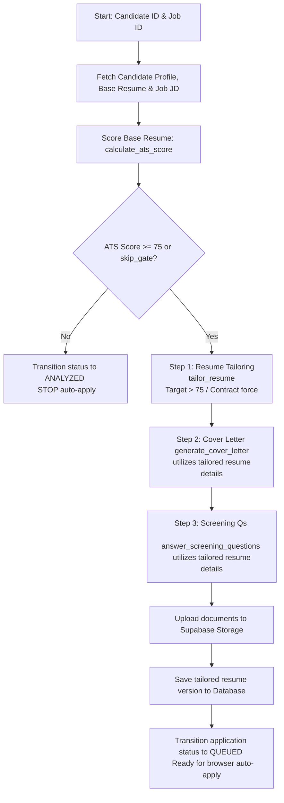

# Module 3 Changes and Execution Flow

This document details the modifications made to Module 3 (AI Resume Intelligence) to remove fit scoring, establish new thresholds, and enforce a sequential document generation flow.

---

## 1. Complete Sequential Flow Diagram

---

## 2. Step-by-Step Flow Breakdown

### A. Gate Check
* **Baseline Score**: The base resume's ATS compatibility score is evaluated using the Gemini API in `calculate_ats_score`.
* **Gate Threshold**: The threshold is set to `75` (customizable via `APPLY_SCORE_THRESHOLD` in `.env`). 
* **Outcome**:
  * If the ATS score is **less than 75** and `skip_gate` is `False`, the application is immediately transitioned to the **`ANALYZED`** state and halts. No documents are generated.
  * If the ATS score is **75 or greater** (or `skip_gate` is `True`), the pipeline proceeds to Document Generation.

### B. Document Generation (Sequential)
To ensure the cover letter and screening questions represent the tailored profile, generation is sequential rather than parallel:
1. **Step 1: Resume Tailoring**:
   * The pipeline calls `tailor_resume` first.
   * If the initial ATS score is **greater than 75** and it is **not** a contract job, the tailoring loop is bypassed (retaining the base resume content as-is).
   * If the score is **75 or less**, or it **is a contract job** (guarantees at least 1 loop run), the LLM optimizes the Summary, Keywords, and Skills sections.
   * Once tailored, the resume is saved, uploaded to Supabase storage, and persisted to the DB to retrieve the `tailored_resume_id`.
   * A `tailored_resume_data` structure containing the updated text is built.
2. **Step 2: Cover Letter**:
   * Calls `generate_cover_letter` using the `tailored_resume_data` instead of the base resume data.
3. **Step 3: Screening Questions**:
   * If the job post contains screening questions, the pipeline calls `answer_screening_questions` using the `tailored_resume_data`.

### C. Finalization
* The cover letter and screening answers are saved.
* The application status transitions to **`QUEUED`**, making the package ready for browser submission.

---

## 3. Detailed Code Modifications

### 1. Fit Scoring Removed
* **File**: `module3/scoring/fit_scorer.py`
* **Changes**:
  * Removed the LLM Job Fit evaluation schema (`LLMFitEvaluation`) and recruitment system prompt.
  * Bypassed LLM-based fit scoring. To prevent downstream breaks in database columns and frontend interfaces, `fit_score` and `combined_score` are mapped directly to `ats_score`.
  * Set the default gate threshold condition to `75.0`.

### 2. Tailoring Threshold and Contract Check
* **File**: `module3/tailoring/resume_tailor.py`
* **Changes**:
  * Added contract check logic to automatically check the job description, title, or job type for the `"contract"` keyword.
  * Adjusted loop condition to target `75.0` (using `<= 75.0`).
  * Enforced that the loop runs at least once for contract positions, even if the base score is already `> 75`.
  * Initialized `basics.headline` with `resume.sections.current_title` as a fallback when tailoring is bypassed.

### 3. Orchestration Sequential Restructuring
* **File**: `module3/orchestrator.py`
* **Changes**:
  * Implemented the baseline gate threshold check of `75` in both `orchestrate_application_package` and `prepare_package_for_live_application`.
  * Refactored both functions to execute steps sequentially and construct a `tailored_resume_data` object that is fed into `generate_cover_letter` and `answer_screening_questions`.

### 4. Router and Test Case Updates
* **Files**:
  * `backend/app/routers/applications.py`: Added `skip_gate` optional field to the `PreparePackageRequest` request schema.
  * `backend/tests/test_prepare_package_api.py`: Updated the test cases to verify the new threshold of `75` and the streamlined sequence of status updates.
